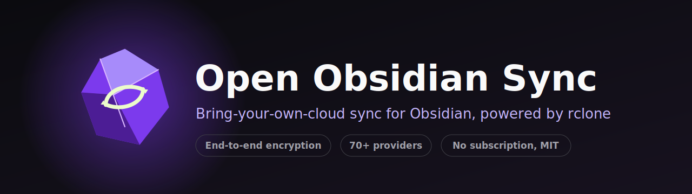
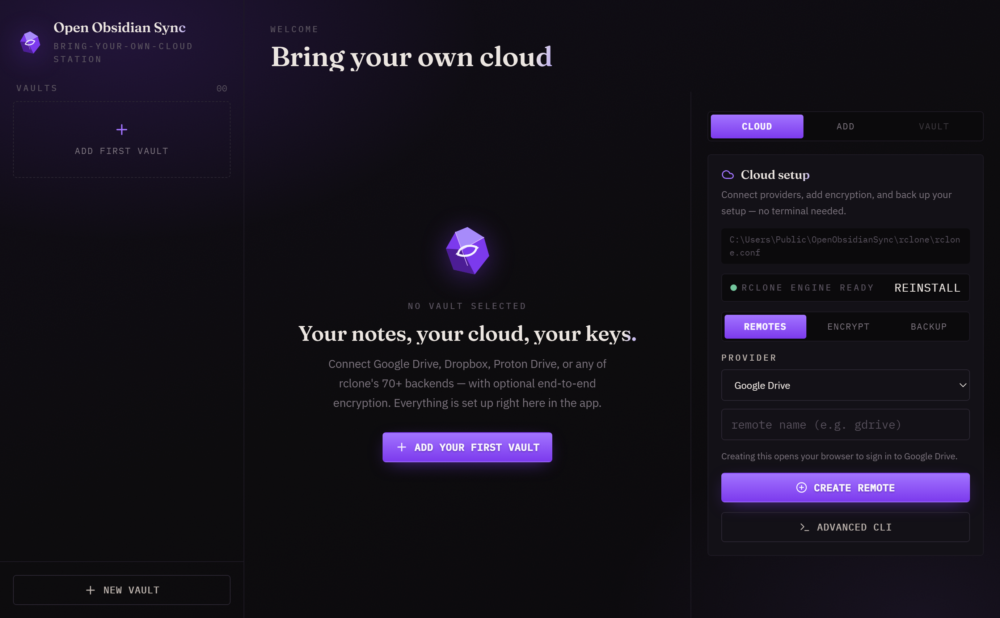
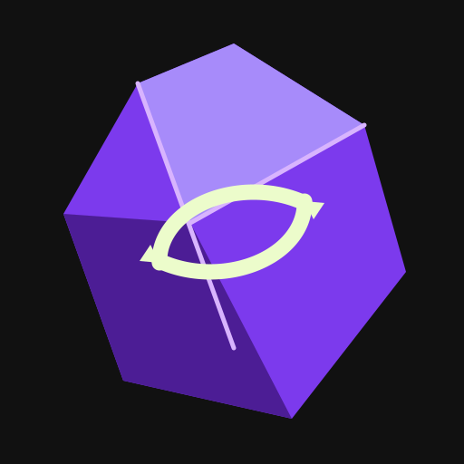

<!-- PROJECT BANNER -->
<p align="center">
  
</p>

<h1 align="center">Open Obsidian Sync</h1>

<p align="center">
  <b>An unofficial, open-source, bring-your-own-cloud sync companion for <a href="https://obsidian.md">Obsidian</a> — powered by <a href="https://rclone.org">rclone</a>.</b>
  <br>
  Set up remotes, encryption, and backups <b>entirely inside the app</b>. No terminal required.
</p>

<p align="center">
  <a href="#-quick-start">Quick Start</a> ·
  <a href="#-features">Features</a> ·
  <a href="#-in-app-setup">In-App Setup</a> ·
  <a href="#-encryption">Encryption</a> ·
  <a href="#-backup--sync-your-settings">Backup &amp; Sync</a> ·
  <a href="#-building-from-source">Build</a> ·
  <a href="#-faq">FAQ</a>
</p>

<p align="center">
  
  
  
  
</p>

<p align="center">
  
  
  
  
  
</p>

<p align="center">
  <a href="https://github.com/StonedModder/open-obsidian-sync/releases/latest"></a>
  <a href="https://github.com/StonedModder/open-obsidian-sync/releases"></a>
</p>

> **Not affiliated with Obsidian.md or Dynalist Inc.** This is a community project. Obsidian and its logo are trademarks of Dynalist Inc.

<br>

<!-- SCREENSHOT -->
<p align="center">
  
</p>

<br>

## ✨ Why this exists

Obsidian's official Sync is great — but it's a subscription, and your notes live on someone else's server. **Open Obsidian Sync** gives you the same day-to-day experience on **cloud storage you already own**: Google Drive, Dropbox, Proton Drive, OneDrive, S3, and [70+ more rclone backends](https://rclone.org/overview/).

Everything — connecting a cloud account, turning on encryption, backing up your setup — is done **through point-and-click in the app**. You should never have to touch a terminal.

<br>

## 🚀 Quick Start

```bash
git clone https://github.com/StonedModder/open-obsidian-sync.git
cd open-obsidian-sync
npm install
npm start
```

Then, inside the app:

1. **Cloud setup → Remotes** → pick your provider → **Create remote** (a browser opens to sign in).
2. **Add vault** → choose your Obsidian folder → pick the remote → **Add vault**.
3. Hit **Resync** once to establish the baseline. After that, it syncs automatically. 🎉

> Prefer a prebuilt binary? Grab the portable `.exe` from [Releases](../../releases), or [build it yourself](#-building-from-source).

<br>

## 🧩 Features

| | |
|---|---|
| ☁️ **Bring your own cloud** | Google Drive, Dropbox, Proton Drive, OneDrive, S3, and [70+ rclone providers](https://rclone.org/overview/) |
| 🖱️ **100% in-app setup** | Create remotes, OAuth sign-in, encryption, and backups — no CLI needed |
| 🔒 **End-to-end encryption** | One-click `rclone crypt` remotes; your provider only ever sees ciphertext |
| 🔑 **Encrypted config at rest** | Cloud tokens sealed with an rclone config password + OS secure storage |
| 🔁 **True bidirectional sync** | Safe `rclone bisync` with `--resync` baseline and conflict recovery |
| 👀 **Live file watching** | Debounced sync on change, on a timer, or from the tray |
| 🎛️ **Selective sync** | Toggle images / audio / video / PDFs, plus custom exclude globs |
| ⚔️ **Conflict strategies** | Keep newer, older, larger, smaller, local, remote, or both |
| 💾 **Portable settings** | Back up your whole setup to the cloud and restore it on another machine |
| 📜 **Activity log** | Every upload, download, and conflict, exportable as JSON |
| 🚫 **No telemetry** | Your notes go only to the cloud remote *you* choose |

<br>

## 🛠️ In-App Setup

The left **Cloud setup** panel has three tabs — this is all you need:

### `Remotes`
Pick a provider, name it, click **Create remote**. For Google Drive / Dropbox / OneDrive, your browser opens to sign in and rclone stores the token for you. Existing remotes show as chips you can delete with one click.

### `Encrypt`
Set an **rclone config password** so your saved cloud tokens are encrypted on disk. The app keeps it in your OS secure storage ([Electron `safeStorage`](https://www.electronjs.org/docs/latest/api/safe-storage)) and unlocks rclone automatically in the background.

### `Backup`
Push your vault list, options, and rclone config to any remote — and restore them on another machine. See [Backup & Sync](#-backup--sync-your-settings).

> Power user? An **Advanced (rclone CLI)** button still opens a raw `rclone config` terminal scoped to this app's config file.

<br>

## 🔒 Encryption

Two independent layers, both configurable in-app:

1. **Encrypted config at rest** — the `Encrypt` tab sets a config password so cloud tokens in `rclone.conf` are never stored in plain text.
2. **End-to-end content encryption** — in the `Remotes` tab, choose **Encrypted (crypt)**, pick an existing base remote, and set a password. Point your vault at the new crypt remote and **your provider only ever stores encrypted blobs** — filenames and contents included.

<p align="center">
  
</p>

Passwords are [obscured by rclone](https://rclone.org/commands/rclone_obscure/) before they touch the config. **Keep your crypt password safe — without it, encrypted files cannot be recovered.** Proton Drive additionally provides its own end-to-end encryption at the backend.

<br>

## 💾 Backup & Sync Your Settings

Moving to a new laptop? Your entire setup — vaults, sync options, and the rclone config — travels with you:

1. Open **Cloud setup → Backup**.
2. Choose a remote (use a **crypt** remote or set a config password to protect tokens).
3. **Back up** → your `config.json` + `rclone.conf` are copied to `Remote:OpenObsidianSync/settings-backup`.
4. On the new machine, install the app, add that same remote, and hit **Restore**. Vaults reload instantly — no re-setup.

> Under the hood this is a plain `rclone copy` of two small files. Nothing proprietary; you can inspect or move the backup yourself.

<br>

## 🏗️ Building From Source

### Develop

```bash
npm install
npm run build
npm start
```

On Windows, generate icons and fetch the rclone binary:

```powershell
powershell -ExecutionPolicy Bypass -File scripts\make-icons.ps1
powershell -ExecutionPolicy Bypass -File scripts\download-rclone.ps1
```

If `resources/rclone/rclone.exe` is missing, the app falls back to `rclone` on your `PATH`.

### Portable Windows build

```bat
compile.bat
```

Checks for Node/npm, installs deps, builds icons, downloads rclone, and produces a portable `.exe` in `release/`.

<br>

## 🧱 Architecture

```
src/
├── main/        Electron main process — tray, watchers, rclone calls, IPC handlers
│   ├── sync.ts    Pure, tested builders for every rclone command
│   ├── store.ts   JSON-backed config + logs
│   └── paths.ts   Portable vs. installed data-dir resolution
├── preload/     Narrow contextBridge IPC surface
├── renderer/    React + Tailwind dashboard (setup, vaults, activity log)
└── shared/      Types shared across processes
```

The sync path is intentionally boring: **validate a vault → write an rclone filter file → run `rclone bisync` → log important lines → update status.** Every command is assembled by a pure function with a self-check in `scripts/sync-self-check.js`.

```bash
npm run typecheck   # both tsconfig projects
npm test            # builds main + runs the sync self-check
npm run build       # renderer + main
```

<br>

## 📂 Where your data lives

Your settings are stored in the OS's stable per-user app-data folder, so **moving or updating the app never loses your vaults**:

| OS | Location |
|---|---|
| Windows | `%APPDATA%\open-obsidian-sync` |
| macOS | `~/Library/Application Support/open-obsidian-sync` |
| Linux | `~/.config/open-obsidian-sync` |

```text
<data folder>/
├── config.json          vaults + options
├── rclone/rclone.conf   your remotes (optionally password-encrypted)
├── bisync/              rclone bisync state
└── filters/             generated selective-sync filters
```

Upgrading from an older build that kept its data next to the `.exe`? Your settings are **migrated automatically** on first launch — nothing to re-set-up.

Want a truly portable copy (data on a USB stick with the exe)? Set `OPEN_OBSIDIAN_SYNC_DATA_DIR` to any folder to override the default.

<br>

## ❓ FAQ

<details>
<summary><b>Is this affiliated with Obsidian?</b></summary>
No. It's an independent, MIT-licensed community project and is not endorsed by Obsidian.md or Dynalist Inc.
</details>

<details>
<summary><b>Do I need to know rclone?</b></summary>
No. Creating remotes, signing in, encryption, and backups are all done through the app UI. The raw rclone terminal is available but optional.
</details>

<details>
<summary><b>Where are my files stored?</b></summary>
Only in the cloud remote you configure. There is no Open Obsidian Sync server and no telemetry.
</details>

<details>
<summary><b>How are conflicts handled?</b></summary>
Via <code>rclone bisync</code>. By default the newer file wins and the loser is kept as an auto-numbered <code>.conflictN</code> copy — never silently overwritten. You can change the strategy per vault.
</details>

<details>
<summary><b>Why bisync instead of a custom cloud SDK?</b></summary>
rclone is a mature, audited tool supporting 70+ providers with checksum verification. Reusing it is safer and covers far more backends than hand-rolled SDK code.
</details>

<br>

## ⚠️ Limits

This is a working open-source sync method, **not** a byte-for-byte clone of the paid Obsidian service.

- No Obsidian account integration.
- No hosted end-to-end-encrypted server (use a **crypt** remote or Proton Drive instead).
- No real-time team collaboration UI.
- No cloud version-history UI yet — use your provider's file recovery in the meantime.

<br>

## 🤝 Contributing

Keep changes small and testable. Prefer rclone backends and flags over custom cloud SDK code. Before opening a PR:

```bash
npm run typecheck && npm test && npm run build
```

<br>

## 📜 License

[MIT](LICENSE) © Open Obsidian Sync contributors.

<p align="center">
  <sub>Built with ❤️ for the Obsidian community · Powered by <a href="https://rclone.org">rclone</a></sub>
</p>
